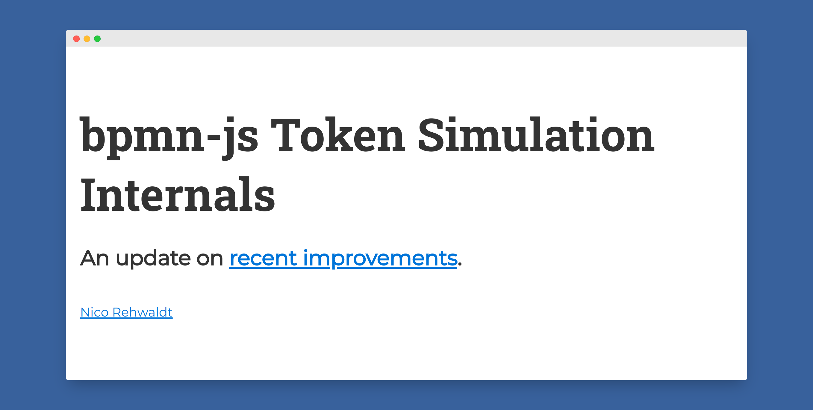

# Token Simulation Internals

A follow up to my [Camunda Community Summit](https://github.com/nikku/2021-token-simulation) talk on [bpmn-js-token-simulation](https://github.com/bpmn-io/bpmn-js-token-simulation).

---

Slide deck built with [`pfwr`](https://github.com/nikku/pfwr).
